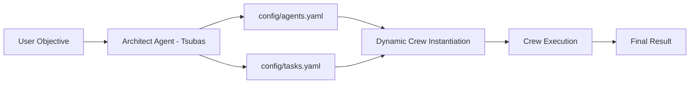

# Tsubas Agent

Tsubas Agent is a self-organizing multi-agent system built on top of [CrewAI](https://github.com/joaomdmoura/crewAI). Given a single natural-language objective, it uses a local LLM ("Tsubas - The Samurai Architect") to **design** a custom team of AI agents and tasks, writes that design to YAML configuration files, and then **instantiates and runs** the generated crew to accomplish the objective — optionally giving agents web search and web scraping capabilities.

## How It Works

The workflow runs in two phases:

1. **Phase 1 — Team Design (`gerar_configuracoes_equipe`)**
   An "architect" agent (backed by a router/reasoning LLM) receives the user's objective and is prompted to produce two YAML blocks separated by `---`:
   - A set of **agents**, each with a `role`, `goal`, `backstory`, and an optional list of `tools`.
   - A set of **tasks**, each with a `description`, `expected_output`, and the `agent` responsible for it.

   The raw LLM output is cleaned (markdown fences stripped), parsed, validated, and saved to [config/agents.yaml](config/agents.yaml) and [config/tasks.yaml](config/tasks.yaml).

2. **Phase 2 — Dynamic Execution (`executar_equipe_dinamica`)**
   The generated YAML files are loaded back, agents and tasks are instantiated dynamically (backed by a worker/execution LLM), tools are attached based on the `tools` field, and the crew is run sequentially via CrewAI's `Process.sequential`.



## Project Structure

```
tsubas-agent/
├── main.py            # Core two-phase pipeline (team generation + execution)
├── main_script.py      # Extended version with web search/scraping tools and stricter YAML validation
├── requeriments.txt    # Python dependencies
└── config/
    ├── agents.yaml      # Auto-generated agent definitions (role, goal, backstory, tools)
    └── tasks.yaml       # Auto-generated task definitions (description, expected_output, agent)
```

- **[main.py](main.py)** — Minimal implementation of the two-phase pipeline described above.
- **[main_script.py](main_script.py)** — Adds two custom CrewAI tools (`pesquisa_web` for DuckDuckGo search and `web_scraping` for page content extraction), stricter YAML parsing/validation, and error handling around the generation step.

## Tools Available to Agents

When the architect decides an agent needs external information, it can attach the following tools (defined in [main_script.py](main_script.py)):

| Tool | Description |
|------|-------------|
| `pesquisa_web` | Searches the web via DuckDuckGo and returns the top results (title, URL, snippet). |
| `web_scraping` | Fetches a URL and extracts clean text content from the page (truncated to 4000 characters). |

## Prerequisites

- Python 3.9+
- [Ollama](https://ollama.com/) running locally (or reachable via network) with the required models pulled, e.g.:
  ```
  ollama pull llama3.1:8b
  ollama pull qwen2.5-coder:7b
  ```

## Installation

```bash
pip install -r requeriments.txt
```

## Configuration

Configuration is done via environment variables (a `.env` file is supported through `python-dotenv`):

| Variable | Default | Purpose |
|----------|---------|---------|
| `OLLAMA_BASE_URL` | `http://localhost:11434` | Base URL of the Ollama server. |
| `MODEL_REVIEWER` | `llama3.1:8b` | Model used by the "architect" agent to design the team (routing/reasoning). |
| `MODEL_CODER` | `qwen2.5-coder:7b` | Model used by the dynamically generated agents (execution/worker). |

Example `.env` file:

```
OLLAMA_BASE_URL=http://localhost:11434
MODEL_REVIEWER=llama3.1:8b
MODEL_CODER=qwen2.5-coder:7b
```

## Usage

Edit the objective string at the bottom of the script you want to run (`objetivo_desejado` in [main.py](main.py) or [main_script.py](main_script.py)), then execute:

```bash
python main.py
```

or, for the version with web search/scraping tools:

```bash
python main_script.py
```

The script will:
1. Print progress as Tsubas designs the team.
2. Write the generated team definition to [config/agents.yaml](config/agents.yaml) and [config/tasks.yaml](config/tasks.yaml).
3. Execute the generated crew and print the final result to the console.

## Generated Configuration Format

**`config/agents.yaml`**
```yaml
agent_1:
  role: "..."
  goal: "..."
  backstory: "..."
  tools: ["pesquisa_web", "web_scraping"]  # optional
```

**`config/tasks.yaml`**
```yaml
task_1:
  description: "..."
  expected_output: "..."
  agent: "agent_1"
```

## License

No license file is currently included in this repository.
