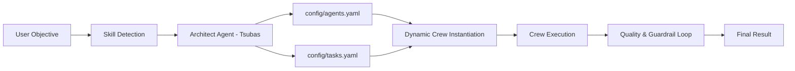

# Tsubas Agent

Tsubas Agent is a self-organizing multi-agent system built on top of [CrewAI](https://github.com/joaomdmoura/crewAI). Given a single natural-language objective, it uses a local LLM ("Tsubas - The Samurai Architect") to **design** a custom team of AI agents and tasks, writes that design to YAML configuration files, and then **instantiates and runs** the generated crew to accomplish the objective. It is general-purpose: agents can be equipped with web search, web scraping, file-saving, and Python code execution/validation tools, and a keyword-based **skills** system automatically steers the design towards a Software Engineer profile (with code tools) whenever the objective is about writing/fixing code, without losing the ability to handle any other kind of request.

## How It Works

The workflow runs in two phases:

1. **Phase 1 — Team Design (`generate_team_configurations`)**
   A keyword-based detector first classifies the objective into a **skill** (`programming`, `research`, or `general`; see [Skills](#skills-automatic-domain-detection)). An "architect" agent (backed by a router/reasoning LLM) then receives the objective plus a hint about the detected skill, and is prompted to produce a single JSON object with:
   - A set of **agents**, each with a `role`, `goal`, `backstory`, and an optional list of `tools`.
   - A set of **tasks**, each with a `description`, `expected_output`, and the `agent` responsible for it.

   The raw LLM output is cleaned (markdown fences stripped), repaired if malformed, validated, and saved to [config/agents.yaml](config/agents.yaml) and [config/tasks.yaml](config/tasks.yaml). A deterministic safety net (`ensure_skill_tools`) then guarantees the detected skill's key tool is assigned to some agent even if the (small, local) architect model forgot to add it.

2. **Phase 2 — Dynamic Execution (`execute_dynamic_team_with_loop`)**
   The generated YAML files are loaded back, agents and tasks are instantiated dynamically (backed by a worker/execution LLM), tools are attached based on the `tools` field, and the crew is run sequentially via CrewAI's `Process.sequential`. A Quality & Verification loop then audits the deliverable (with deterministic guardrails for invalid JSON/Python output, in addition to an LLM-based inspector) and triggers rework if needed.



## Project Structure

```
tsubas-agent/
├── main.py            # Minimal two-phase pipeline (team generation + execution)
├── main_script.py      # Full-featured version: skills, tools, self-correction & quality loops, CLI
├── requeriments.txt    # Python dependencies
└── config/
    ├── agents.yaml      # Auto-generated agent definitions (role, goal, backstory, tools)
    └── tasks.yaml       # Auto-generated task definitions (description, expected_output, agent)
```

- **[main.py](main.py)** — Minimal implementation of the two-phase pipeline described above, no tools/skills/loops.
- **[main_script.py](main_script.py)** — The full-featured entry point: skills auto-detection, `web_search`/`web_scraping`/`save_local_file`/`run_python_code` tools, a design self-correction loop, a post-execution quality/guardrail loop, and a full CLI (see [Usage](#usage)).

## Skills (Automatic Domain Detection)

`main_script.py` classifies every objective into one of these skills using a fast, offline keyword match (`detect_skill`, no LLM call needed) before designing the team:

| Skill | Triggered by | Effect |
|-------|--------------|--------|
| `programming` | Words like "código/code", "script", "função", "bug", "python", "api", "software", "debug", etc. | Biases the architect towards a "Senior Software Engineer" agent and **guarantees** the `run_python_code` tool is assigned, so code gets executed and validated (not just written) before delivery. Also adds a Python-syntax guardrail on `.py` deliverables in the quality loop. |
| `research` | Words like "pesquise", "relatório", "notícia", "histórico", "cotação", etc. | Biases towards a "Senior Research Analyst" agent using `web_search`/`web_scraping`. |
| `general` | Anything else | No forced profile; the architect designs freely from the available tools, exactly as before. |

The detected skill can be forced explicitly with `--skill {programming,research,general}` if the heuristic guesses wrong.

## Tools Available to Agents

The architect assigns tools per agent based on the objective/skill; all tools below are defined in [main_script.py](main_script.py):

| Tool | Description |
|------|-------------|
| `web_search` | Searches the web (trying several backends in sequence) and returns the top results (title, URL, snippet). |
| `web_scraping` | Fetches a URL and extracts clean text content from the page (truncated to 4000 characters). |
| `save_local_file` | Saves the agent's deliverable (JSON, Markdown, TXT, CSV, Python, HTML, ...) into the `output/` directory. |
| `run_python_code` | Executes a Python snippet in an isolated subprocess and returns stdout/stderr/exit code, so agents can test and fix code before finalizing it. **Security:** this really executes generated code locally with the current OS user's privileges — only enable it in trusted/dev environments. Set `ENABLE_CODE_EXECUTION=false` to disable it entirely. |

## Prerequisites

- Python 3.9+
- [Ollama](https://ollama.com/) running locally (or reachable via network) with the required models pulled, e.g.:
  ```
  ollama pull llama3.1:8b
  ollama pull qwen2.5-coder:7b
  ```

## Installation

```bash
pip install -r requeriments.txt
```

## Configuration

Configuration is done via environment variables (a `.env` file is supported through `python-dotenv`). Every variable below can also be overridden per-run through CLI flags (see [Usage](#usage)) without editing `.env`.

| Variable | Default | Purpose |
|----------|---------|---------|
| `OLLAMA_BASE_URL` | `http://localhost:11434` | Base URL of the Ollama server. |
| `MODEL_REVIEWER` | `llama3.1:8b` | Model used by the "architect"/inspector agents (design + quality review). |
| `MODEL_WORKER` | `qwen2.5-coder:7b` | Model used by the dynamically generated execution agents. ([main.py](main.py) also accepts the legacy `MODEL_CODER` name as a fallback.) |
| `SEARCH_TIMEOUT` | `8` | Seconds before giving up on a single search backend ([main_script.py](main_script.py) only). |
| `SCRAPE_TIMEOUT` | `10` | Seconds before giving up on a web scrape request ([main_script.py](main_script.py) only). |
| `AGENT_MAX_ITER` | `8` | Max reasoning iterations per agent per task. Lower = faster but less thorough. |
| `DESIGN_MAX_ATTEMPTS` | `3` | Max self-correction attempts in the team-design loop. |
| `QUALITY_MAX_LOOPS` | `2` | Max inspector rework cycles after execution. `0` disables the loop entirely. |
| `SEARCH_BACKENDS` | `google,bing,duckduckgo,brave,yahoo,mojeek` | Comma-separated search engines tried in order (a working one is auto-promoted to the front). |
| `CODE_EXEC_TIMEOUT` | `20` | Seconds before a `run_python_code` execution is killed as timed out. |
| `ENABLE_CODE_EXECUTION` | `true` | Set to `false` to disable `run_python_code` entirely (it returns a disabled notice instead of running anything). |

Example `.env` file:

```
OLLAMA_BASE_URL=http://localhost:11434
MODEL_REVIEWER=llama3.1:8b
MODEL_WORKER=qwen2.5-coder:7b
```

## Usage

Both entry points accept the objective directly from the command line instead of editing the source:

```bash
python main_script.py "Pesquise o preco do PlayStation 5 em 2026 e salve em output/ps5.json"
```

```bash
python main.py "Criar um script Python que faca web scraping de cotacoes de moedas"
```

The objective can also come from a file or piped stdin instead of a CLI argument:

```bash
python main_script.py --file prompts/meu_objetivo.txt
type prompts\meu_objetivo.txt | python main_script.py
```

If no objective, `--file`, or piped input is given, each script falls back to its built-in example objective.

### [main_script.py](main_script.py) flags

| Flag | Purpose |
|------|---------|
| `-f, --file PATH` | Read the objective from a text file. |
| `-o, --output PATH` | Force the deliverable path, skipping auto-detection. |
| `--attempts N` | Max design self-correction attempts (default `3`). |
| `--quality-loops N` | Max inspector rework cycles (default `2`); `0` disables it. |
| `--max-iter N` | Max reasoning iterations per agent (default `8`). |
| `--no-review` | Skip the quality inspector loop entirely. Biggest single speed win (see [Performance Tips](#performance-tips)). |
| `--reuse-config` | Skip team design and reuse the existing `config/agents.yaml` + `config/tasks.yaml`. |
| `--fast` | Preset: `--attempts 1 --no-review --max-iter 5 --quiet`. |
| `--quiet` | Reduce CrewAI console verbosity. |
| `--ollama-url URL` / `--model-router NAME` / `--model-worker NAME` | Per-run overrides of the `.env` connection/model settings. |
| `--skill {programming,research,general}` | Force a specific skill instead of auto-detecting it from the objective. |

Run `python main_script.py --help` for the full list.

Each run will:
1. Print progress as Tsubas designs the team (skipped with `--reuse-config`).
2. Write the generated team definition to [config/agents.yaml](config/agents.yaml) and [config/tasks.yaml](config/tasks.yaml).
3. Execute the generated crew and print the final result and total elapsed time to the console.

## Performance Tips

Execution time is dominated by LLM round-trips, not by the Python code itself. In rough order of impact:

1. **Avoid swapping models on the Ollama server.** `MODEL_REVIEWER` (architect/inspector) and `MODEL_WORKER` (execution agents) are called in alternation (design → execution → inspection → rework → ...). If your Ollama server can't keep both models loaded at once, each switch forces a slow reload from disk. Fixes:
   - Set `MODEL_REVIEWER` and `MODEL_WORKER` to the **same** model, or
   - On the Ollama server, raise `OLLAMA_MAX_LOADED_MODELS` and `OLLAMA_KEEP_ALIVE` (e.g. `30m`) so both models stay resident.
2. **Skip the quality/inspector loop** with `--no-review` (or `--fast`) when you trust the first pass — this removes the inspector-model round-trip and any correction/rework cycles entirely.
3. **Reuse an existing design** with `--reuse-config` when iterating on the same objective, to skip the team-design LLM calls altogether.
4. **Lower `--max-iter`** (and `--attempts`) to cap how many reasoning steps/retries an agent can spend per task.
5. Search/scrape calls are cached in-memory per run and a working search backend is auto-promoted to the front of the list, so repeated or previously-failing lookups stop costing full retries.

## Generated Configuration Format

**`config/agents.yaml`**
```yaml
agent_1:
  role: "..."
  goal: "..."
  backstory: "..."
  tools: ["web_search", "web_scraping", "run_python_code", "save_local_file"]  # optional, picked per objective
```

**`config/tasks.yaml`**
```yaml
task_1:
  description: "..."
  expected_output: "..."
  agent: "agent_1"
```

## Security Notes

- `run_python_code` executes model-generated code locally (subprocess, isolated temp dir, timeout-bound, no network/file-system sandboxing beyond that). Treat it like any other code-execution/interpreter tool: only run this application in trusted/dev environments, and disable it with `ENABLE_CODE_EXECUTION=false` if the objective source isn't trusted.
- `web_scraping` makes outbound HTTP requests to arbitrary URLs chosen by the LLM/agent at runtime; no allow-list or SSRF protection is implemented.

## License

No license file is currently included in this repository.
